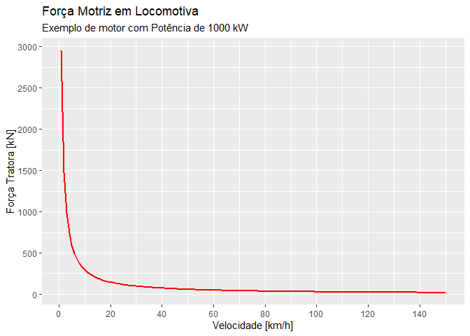
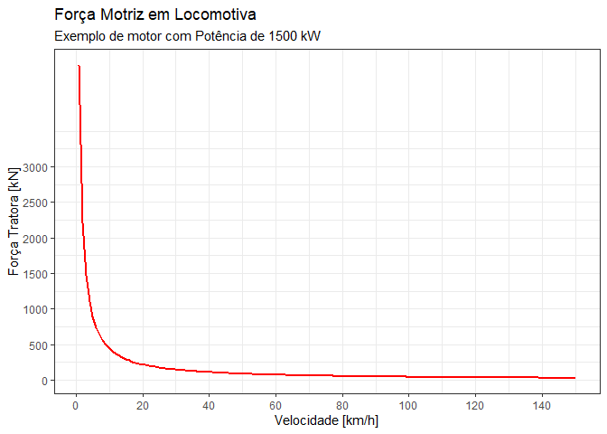

# STT0408 - Fundamentos de Engenharia de Transportes
Prof. André Luiz Cunha, Prof. José Reynaldo Setti

- [AULAS \| 2025](#aulas--2025)
  - [0. Revisão de Planilhas
    Eletrônicas](#0-revisão-de-planilhas-eletrônicas)
  - [1. Força Motriz em Veículos
    Ferroviários](#1-força-motriz-em-veículos-ferroviários)
    - [Forças Atuantes](#forças-atuantes)
    - [Equilíbrio de Forças](#equilíbrio-de-forças)
    - [Força Motriz](#força-motriz)
    - [Eficiência de Transmissão](#eficiência-de-transmissão)
    - [Tração por aderência](#tração-por-aderência)

# AULAS \| 2025

## 0. Revisão de Planilhas Eletrônicas

**Objetivo**  
Aula introdutória e de nivelamento em programação usando planilhas
eletrônicas. A automatização de cálculos é ferramenta essencial no
desenvolvimento de projetos de Engenharia, assim como no projeto de
curso desta disciplina.

**Material de referência**  
Alguns livros que recomendo para quem busca se especializar em
programação efetiva com planilhas

- “*[Crie Planilhas Inteligentes com o Microsoft Office Excel 2003.
  Avançado](https://www.amazon.com.br/Planilhas-Inteligentes-Microsoft-Office-Avan%C3%A7ado/dp/8571949921)*” -
  Haddad & Haddad

- “*[Ctrl+shift+enter: A Book about Building Efficient
  Formulas](https://www.amazon.com/Shift-Enter-Mastering-Excel-Formulas/dp/1615470077)*” -
  Mike Girvin

- “*[Microsoft 365 Excel: The Only App That
  Matters](https://www.amazon.com/Microsoft-365-Excel-Calculations-Analytics/dp/1615470700)*” -
  Mike Girvin

## 1. Força Motriz em Veículos Ferroviários

### Forças Atuantes

- Força Motriz ou Tratora ($F_{t}$)
- Resistências ($R_{t}$)
- Força Peso ($G$)
- Força Normal ($N$)


### Equilíbrio de Forças

- $F_{t} < R_{t} \Rightarrow$ desacelerando
- $F_{t} > R_{t} \Rightarrow$ acelerando
- $F_{t} = R_{t} \Rightarrow$ velocidade constante

### Força Motriz

A *Potência* é derivada do *Trabalho de uma Força*, portanto:

$$
P = \frac{dW}{dt} \Rightarrow \frac{d(F \cdot S )}{dt} \Rightarrow F \cdot \frac{dS}{dt} \Rightarrow F \cdot v
$$

Sendo:  
- $W$ o Trabalho da Força \[W - *Watt*\]  
- $F$ a resultante da Força \[N - *Newton*\]  
- $S$ o deslocamento \[m - *metros*\]  
- $v$ a velocidade do veículo \[m/s\]

Para o cálculo da Força Motriz em função da Potência, utilizamos a
seguinte equação com as unidades métricas:

$$
F_{t} = 3,6 \cdot \frac{P}{v}
$$

Sendo:  
- $W$ o Trabalho da Força \[kW\]  
- $F$ a resultante da Força \[kN\]  
- $v$ a velocidade do veículo \[km/h\]

### Eficiência de Transmissão

Em todo motor existem perdas resultante do atrito das peças, do sistema
de transmissão, dos sistemas auxiliares (compressor, corrente,
alternador, etc.). Portanto admitimos uma eficiência $\eta$, em
locomotivas, em torno de **0,82**:

$$
F_{t} = \eta \cdot 3,6 \cdot \frac{P}{v}
$$

Dessa forma, o gráfico da $F_{t} = f(V)$, para uma **Potência**
constante de, por exemplo, $1.000~kW$ será de:

``` r
# Potência em kW
P = 1000
# Eficiência
n = 0.82
# Velocidades em km/h
v = 1:150

Ft = n * 3.6 * ( P / v )

plot(v, Ft, type='l', col='red', lwd=2, 
     xlab='Velocidade [km/h]',
     ylab='Força Tratora [kN]')
```



É importante observar que o gráfico apresenta valores para qualquer
extremidade, e sabemos que os motores tem limitações, a saber: 1. da
corrente elétrica (máxima força tratora disponível) no eixo Y,  
2. da voltagem ou rotação do motor (máxima velocidade disponível) no
eixo X.

Dessa forma, a função anterior fica limita a esses dois limites. Como
exemplo, considere a velociade máxima de $90~km/h$ e a força tratora
máxima pela corrente elétrica $Ftce = 150~kN$.

``` r
# Potência em kW
P = 1000
# Eficiência
n = 0.82
# Limite da voltagem/rotação do motor
vmax = 90 #km/h
# Velocidades em km/h
v = 1:vmax
# Limite da corrente elétrica
Ftce = 150 #kN

## EQUAÇAO
Ft = n * 3.6 * ( P / v )
# LIMITE
Ft[Ft > Ftce] = Ftce

# Acrescentar o último ponto para fechar o limite.
v <- c(v, vmax)
Ft <- c(Ft, 0)

## Plotar
plot(v, Ft, type='l', col='red', lwd=2, 
     xlab='Velocidade [km/h]',
     ylab='Força Tratora [kN]')
```



### Tração por aderência

Para que a locomotiva não patine, a **Força Tratora** nas rodas deve ser
menor que a **Força de aderência** entre o trilho e as rodas:
$F_{t} \leq F_{a}$.

Portanto a **Força Motriz Máxima** está limitada a aderência na
interface roda-trilho:

$$
Ft_{max} \leq f \cdot T_{d}
$$

Em que:  
- $T_{d}$ é o peso aderente \[kN\]  
- $f$ é a aderência

| Estado do trilho   | Aderência |
|:-------------------|----------:|
| Totalmente seco    |      0,33 |
| Lavado pela chuva  |      0,33 |
| Seco e limpo       |      0,22 |
| Seco               |      0,20 |
| Molhado pela chuva |      0,14 |
| Úmido de orvalho   |     0,125 |
| Úmido e sujo       |      0,11 |
| Sujo de óleo       |      0,10 |
