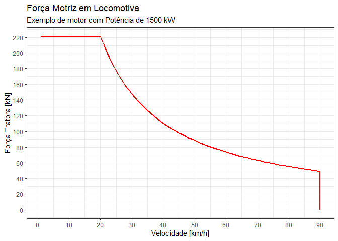
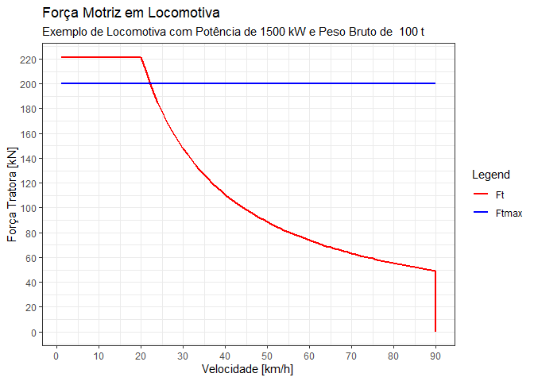
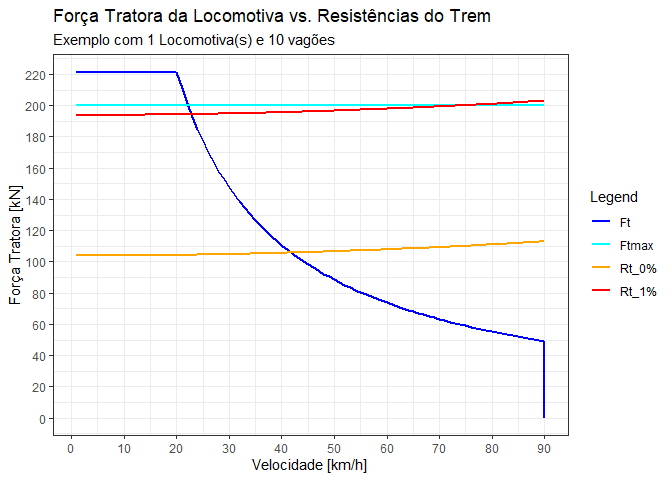

# STT0408 - Fundamentos de Engenharia de Transportes
Prof. André Luiz Cunha, Prof. José Reynaldo Setti

- [AULAS \| 2025](#aulas--2025)
  - [0. Revisão de Planilhas
    Eletrônicas](#0-revisão-de-planilhas-eletrônicas)
  - [1. Força Motriz em Veículos
    Ferroviários](#1-força-motriz-em-veículos-ferroviários)
    - [Forças Atuantes](#forças-atuantes)
    - [Equilíbrio de Forças](#equilíbrio-de-forças)
    - [Força Motriz](#força-motriz)
    - [Eficiência de Transmissão](#eficiência-de-transmissão)
    - [Tração por aderência](#tração-por-aderência)
  - [2. Resistências ao Movimento](#2-resistências-ao-movimento)
    - [Resistência ao Rolamento](#resistência-ao-rolamento)
    - [Resistência Aerodinâmica](#resistência-aerodinâmica)
    - [Resistência de Rampa](#resistência-de-rampa)
    - [Resistência de Curva](#resistência-de-curva)
  - [3. Comprimento máximo do trem](#3-comprimento-máximo-do-trem)

# AULAS \| 2025

## 0. Revisão de Planilhas Eletrônicas

**Objetivo**  
Aula introdutória e de nivelamento em programação aplicada a planilhas
eletrônicas. A automação de cálculos é uma ferramenta fundamental no
desenvolvimento de projetos de Engenharia, além de desempenhar um papel
essencial no planejamento e execução do projeto desta disciplina.

**Material de referência**  
Aqui estão alguns livros que recomendo para quem deseja se aprofundar em
programação eficiente com planilhas.

- “*[Crie Planilhas Inteligentes com o Microsoft Office Excel 2003.
  Avançado](https://www.amazon.com.br/Planilhas-Inteligentes-Microsoft-Office-Avan%C3%A7ado/dp/8571949921)*” -
  Haddad & Haddad

- “*[Ctrl+shift+enter: A Book about Building Efficient
  Formulas](https://www.amazon.com/Shift-Enter-Mastering-Excel-Formulas/dp/1615470077)*” -
  Mike Girvin

- “*[Microsoft 365 Excel: The Only App That
  Matters](https://www.amazon.com/Microsoft-365-Excel-Calculations-Analytics/dp/1615470700)*” -
  Mike Girvin

## 1. Força Motriz em Veículos Ferroviários

### Forças Atuantes

- Força Motriz ou Tratora ($F_{t}$)
- Resistências ($R_{t}$)
- Força Peso ($G$)
- Força Normal ($N$)


### Equilíbrio de Forças

- $F_{t} < R_{t} \Rightarrow$ desacelerando
- $F_{t} > R_{t} \Rightarrow$ acelerando
- $F_{t} = R_{t} \Rightarrow$ velocidade constante

### Força Motriz

A *Potência* é derivada do *Trabalho de uma Força*, portanto:

$$
P = \frac{dW}{dt} \Rightarrow \frac{d(F \cdot S )}{dt} \Rightarrow F \cdot \frac{dS}{dt} \Rightarrow F \cdot v
$$

Sendo:  
- $W$ o Trabalho da Força \[W - *Watt*\]  
- $F$ a resultante da Força \[N - *Newton*\]  
- $S$ o deslocamento \[m - *metros*\]  
- $v$ a velocidade do veículo \[m/s\]

Para o cálculo da Força Motriz em função da Potência, utilizamos a
seguinte equação com as unidades métricas:

$$
F_{t} = 3,6 \cdot \frac{P}{v}
$$

Sendo:  
- $W$ o Trabalho da Força \[kW\]  
- $F$ a resultante da Força \[kN\]  
- $v$ a velocidade do veículo \[km/h\]

### Eficiência de Transmissão

Em todo motor existem perdas resultante do atrito das peças, do sistema
de transmissão, dos sistemas auxiliares (compressor, corrente,
alternador, etc.). Portanto admitimos uma eficiência $\eta$, em
locomotivas, em torno de **0,82**:

$$
F_{t} = \eta \cdot 3,6 \cdot \frac{P}{v}
$$

Dessa forma, o gráfico da $F_{t} = f(V)$, para uma **Potência**
constante de, por exemplo, $1.500$ kW será de:

``` r
# Potência em kW
P = 1500
# Eficiência
n = 0.82
# Velocidades em km/h
v = 1:150

Ft = n * 3.6 * ( P / v )

df <- data.frame(v = v, 
                 Ft = Ft)

df |> ggplot(aes(x=v, y=Ft)) +
  geom_line(color='red', linewidth=1) +
  scale_x_continuous(breaks=seq(0,140,20)) +
  scale_y_continuous(breaks=seq(0,3000,500)) +
  xlab("Velocidade [km/h]") +
  ylab("Força Tratora [kN]") +
  labs(title = "Força Motriz em Locomotiva",
       subtitle = paste("Exemplo de motor com Potência de",P,"kW")) +
  theme_bw()
```


``` r
# plot(v, Ft, type='l', col='red', lwd=2, 
#      xlab='Velocidade [km/h]',
#      ylab='Força Tratora [kN]')
```

É importante observar que este gráfico apresenta valores tendendo ao
infinito nas extremidades, e sabemos que os motores tem limitações, a
saber:

1.  da corrente elétrica (máxima força tratora disponível) no eixo Y,  
2.  da voltagem ou rotação do motor (máxima velocidade disponível) no
    eixo X.

Dessa forma, a função anterior fica limita a esses dois limites. Como
exemplo, considere a velocidade máxima de 90 km/h e a força tratora
máxima pela corrente elétrica, limitada pela **Velocidade Mínima de
Operação Constante** (VMOC) de 20 km/h.

``` r
# Potência em kW
P = 1500
# Eficiência
n = 0.82
# Limite da voltagem/rotação do motor
vmax = 90 #km/h
# Velocidades em km/h
v = 1:vmax
# Limite da corrente elétrica - VMOC
VMOC = 20 #km/h
Ftce = n * 3.6 * (P / VMOC) #kN

## EQUAÇAO
Ft = n * 3.6 * ( P / v )
# LIMITE
Ft[Ft > Ftce] = Ftce

# Acrescentar o último ponto para fechar o limite.
v <- c(v, vmax)
Ft <- c(Ft, 0)

df <- data.frame(v = v,
                 Ft = Ft)

## Plotar
df |> ggplot(aes(x=v, y=Ft)) +
  geom_line(color='red', linewidth=1) +
  scale_x_continuous(breaks=seq(0,vmax,10)) +
  scale_y_continuous(breaks=seq(0,round(Ftce/5,0)*5,20)) +
  xlab("Velocidade [km/h]") +
  ylab("Força Tratora [kN]") +
  labs(title = "Força Motriz em Locomotiva",
       subtitle = paste("Exemplo de motor com Potência de",P,"kW")) +
  theme_bw()
```



### Tração por aderência

Para que as rodas da locomotiva não patine, a **Força Tratora** que o
motor despeja nas rodas deve ser menor que a **Força de aderência**
entre o trilho e as rodas: $F_{t} \leq F_{a}$.

Portanto a **Força Motriz Máxima** está limitada pela **aderência** da
interface roda-trilho:

$$
Ft_{max} \leq f \cdot T_{d}
$$

Em que:  
- $T_{d}$ é o peso aderente \[kN\]  
- $f$ é a aderência

A tabela abaixo[^1] descreve valores típicos do *coeficiente de
aderência* $f$ para várias condições do trilho.

| ***Estado do trilho*** | ***Aderência*** |
|:-----------------------|----------------:|
| Totalmente seco        |            0,33 |
| Lavado pela chuva      |            0,33 |
| Seco e limpo           |            0,22 |
| Seco                   |            0,20 |
| Molhado pela chuva     |            0,14 |
| Úmido de orvalho       |           0,125 |
| Úmido e sujo           |            0,11 |
| Sujo de óleo           |            0,10 |

------------------------------------------------------------------------

**EXEMPLO: Força Tratora**

Considere uma locomotiva com Peso Bruto Total de 100 toneladas e um
fator de aderência $f$ de 0,20, portanto:

``` r
# Potência em kW
P = 1500
# Eficiência
n = 0.82
# Limite da voltagem/rotação do motor
vmax = 90 #km/h
# Velocidades em km/h
v = 1:vmax
# Limite da corrente elétrica - VMOC
VMOC = 20 #km/h
Ftce = n * 3.6 * (P / VMOC) #kN
# Peso Bruto [t]
M = 100 #t
# Peso Bruto em [kN]
G = M * 10 # g (gravidade) = 10 m/s²
# Fator de aderência
f = 0.20


## EQUAÇAO
Ft = n * 3.6 * ( P / v )
# LIMITE
Ft[Ft > Ftce] = Ftce

# Acrescentar o último ponto para fechar o limite.
v <- c(v, vmax)
Ft <- c(Ft, 0)

# Aderência Máxima
Ftmax = G * f

# Força de Aderência

df <- data.frame(v = v,
                 Ft = Ft,
                 Ftmax = Ftmax)

## Plotar
colors <- c("Ft" = "red", "Ftmax" = "blue")
df |> ggplot(aes(x=v)) +
  geom_line(aes(y=Ft, color='Ft'), linewidth=1) +
  geom_line(aes(y=Ftmax, color='Ftmax'), linewidth=1)+
  scale_x_continuous(breaks=seq(0,vmax,10)) +
  scale_y_continuous(breaks=seq(0,round(Ftce/5,0)*5,20)) +
  labs( title = "Força Motriz em Locomotiva",
        subtitle = paste("Exemplo de Locomotiva com Potência de",P,"kW e Peso Bruto de ",M, "t"),
        x = "Velocidade [km/h]",
        y = "Força Tratora [kN]",
        color="Legend" ) +
  theme_bw() +
  scale_color_manual(values = colors)
```



> [**ATIVIDADE 1**](_atividades/ATV01.pdf)

------------------------------------------------------------------------

## 2. Resistências ao Movimento

As forças resistivas ao movimento de um veículo ferroviário podem ser
representadas por:

$$
R_t = R_r + R_a + R_g + R_c
$$

Sendo,  
- $R_t$ : resistência total \[kN\]  
- $R_r$ : resistência ao rolamento \[kN\]  
- $R_a$ : resistência aerodinâmica \[kN\]  
- $R_g$ : resistência de rampa \[kN\]  
- $R_c$ : resistência de curva \[kN\]

Dentre todas essas resistências, as resistências **ao rolamento e
aerodinâmica** sempre existe, portanto é denominado de ***Resistência
Básica*** ou ***Resistência Inerente***.

### Resistência ao Rolamento

Segundo o modelo proposto por Davis (1910):

$$
R_r = \left( c_1 + \frac{c_2 \cdot x}{G} + c_3 * V \right) \cdot \frac{G}{1000}
$$

Em que,  
- $R_r$ : resistência ao rolamento \[kN\]  
- $x$ : número de eixos da locomotiva ou vagão  
- $G$ : peso da locomotiva ou vagão \[kN\]  
- $V$ : velocidade do veículo \[km/h\]  
- $c_1$ : constante que incorpora o efeito da deformação da roda e do
trilho ($\approx 0,65$)  
- $c_2$ : constante que incorpora o efeito do atrito dos mancais
($\approx 125$)  
- $c_3$ : constante que incorpora o efeito do atrito entre friso das
rodas e trilho (passageiro e locomotiva $\approx 0,009$; vagão
$\approx 0,013$)

### Resistência Aerodinâmica

$$
R_a = \frac{c_a \cdot A \cdot V^2}{1000}
$$

Tal que,  
- $R_a$ : resistência aerodinâmica \[kN\]  
- $c_a$ : coeficiente aerodinâmico  
- $A$ : área frontal do veículo \[m²\]

| **Tipo de veículo**       | **Área frontal (m²)** | **$c_a$** |
|:--------------------------|:----------------------|----------:|
| Locomotiva de carga       | 9 – 14,5              |     0,046 |
| Locomotiva de passageiros | 9 – 11                |     0,031 |
| Vagões de carga           | 7,5 – 8,5             |     0,009 |
| Carros de passageiros     | 10 – 11               |     0,006 |

### Resistência de Rampa

$$
R_g = G \cdot i
$$

Em que,  
- $R_g$ : resistência de rampa em \[kN\]  
- $G$ : peso do veículo (locomotiva ou vagão) \[kN\]  
- $i$ : declividade da rampa \[% – em decimal\]

### Resistência de Curva

$$
R_c = 0,698 \cdot \frac{G}{r}
$$

Sendo,  
- $R_c$ : resistência de curva \[kN\]  
- $G$ : peso do veículo (locomotiva ou vagão) \[kN\]  
- $r$ : raio de curva \[m\]

------------------------------------------------------------------------

**EXEMPLO: Resistências**

Considere uma locomotiva descrita anteriormente, área frontal de 10 m² e
6 eixos, rebocando 10 vagões com massa de 80 toneladas, área frontal de
8 m² e 4 eixos cada. Considere o trecho plano e um aclive de 1,0%, sem
curva. Utilizando as equações e parâmetros anteriores teremos:

``` r
## CONSTANTES
# Gravidade
g = 10 #m/s²

## LOCOMOTIVA:
# Número de locomotivas
nL = 1
# Número de eixos da locomotiva
xL = 6
# Área frontal da locomotiva
AL = 9.0 #m²
# Potência em kW
P = 1500
# Eficiência
eta = 0.82
# Limite da voltagem/rotação do motor
vmax = 90 #km/h
# Limite da corrente elétrica - VMOC
VMOC = 20 #km/h
# Força Tratora Máxima da Corrente Elétrica
Ftce = eta * 3.6 * (P / VMOC) #kN
# Massa da Locomotiva [t]
mL = 100 #t
# Peso Bruto em [kN]
GL = mL * 10 # g (gravidade) = 10 m/s²
# Fator de aderência
f = 0.20

## VAGÕES
# Número de vagões
nV = 10
# Número de eixos do vagão
xV = 4
# Área frontal ddo vagão
AV = 8.0 #m²
# Massa de cada vagão
mV = 80 # t
# Peso Bruto do vagão em [kN]
GV = mV * g #kN

## DATAFRAME
df <- data.frame(
  V     = c(1:vmax,vmax),
  FtCE  = Ftce
  ) %>% 
  rowwise(V) %>% 
  mutate(
    FtMotor  = nL * (eta * 3.6 * P / V),
    Ft       = min(FtCE,FtMotor),
    Ftmax    = nL * (f * GL),
    R_Loc    = ((0.65 + (125 * xL) / GL + 0.009 * GL ) * GL / 1000) + (0.046 * AL * V * V)/1000,
    R_Vag    = ((0.65 + (125 * xV) / GV + 0.013 * GV ) * GV / 1000) + (0.009 * AV * V * V)/1000,
    Rt_plano = nL * R_Loc + nV * R_Vag,
    Rt_aclive= Rt_plano + 0.01 * (nL * GL + nV * GV)
  )
df$Ft[nrow(df)] = 0.0

## Plotar
colors <- c("Ft" = "blue", "Ftmax" = "cyan", "Rt_0%" = "orange", "Rt_1%" = "red")
df |> ggplot(aes(x=V)) +
  geom_line(aes(y=Ft, color='Ft'), linewidth=1) +
  geom_line(aes(y=Ftmax, color='Ftmax'), linewidth=1)+
  geom_line(aes(y=Rt_plano, color='Rt_0%'), linewidth=1)+
  geom_line(aes(y=Rt_aclive, color='Rt_1%'), linewidth=1)+
  scale_x_continuous(breaks=seq(0,vmax,10)) +
  scale_y_continuous(breaks=seq(0,round(max(df$Ft)/5,0)*5,20)) +
  labs( title = "Força Tratora da Locomotiva vs. Resistências do Trem",
        subtitle = paste("Exemplo com", nL, "Locomotiva(s) e", nV, "vagões"),
        x = "Velocidade [km/h]",
        y = "Força Tratora [kN]",
        color="Legend" ) +
  theme_bw() +
  scale_color_manual(values = colors)
```



Perceba que no trecho plano, a velocidade de equilíbrio para o trem do
exemplo (1 locomotiva + 10 vagões) é em torno de 44 km/h. Já no aclive
de 1,0%, a composição tem velocidade de equilíbrio de 22 km/h. Ambas as
situações considerando a Potência máxima da locomotiva, portanto
cruzando com a curva da Froça Tratora ($F_t$). Lembre-se que toda a área
abaixo da curva de $F_t$ é possível de ser operada.

> [**ATIVIDADE 2**](_atividades/ATV02.pdf)

## 3. Comprimento máximo do trem

Para determinar o máximo comprimento que um trem pode trafegar, é
necessário analisar o **trecho mais crítico**, ou seja, a rampa mais
íngreme. Assim, dimensionando o número de locomotivas e vagões para o
prior trecho, todos os demais segmentos da via serão atendidos.

Portanto o dimensionamento segue o seguinte procedimento:

1.  Determine o **trecho crítico**, aclive mais íngreme;

2.  Para este trecho, determine a velocidade de operação ($V_{op}$) a
    ser adotada, lembrando que não se pode operar o trem abaixo da
    **VMOC** – *Velocidade Mínima de Operação Constante*;

3.  Para a $V_{op}$, determine a relação do ***número de vagões que uma
    locomotiva consegue rebocar***:

$$
F_t - R_t = m \cdot a \rightarrow F_t = R_t
$$

$$
F_t(V_{op}) = R_t^{Loc}(V_{op}) + n^{Vag} \cdot R_t^{Vag}(V_{op})
$$

$$
n^{Vag} = \frac{F_t(V_{op}) - R_t^{Loc}(V_{op})}{R_t^{Vag}(V_{op})}
$$

4.  Guarde esta relação: 1 Locomotiva $\rightarrow n^{Vag}$.

5.  A partir da **Força Máxima do Engate** ($F_{eng}$), em torno de
    1.200 a 1.500 kN, determine qual a quantidade máxima de vagões que o
    engate é capaz de suportar:

$$ 
n_{max.Vag} = \frac{F_{eng}}{R^{Vag}_t(V_{op})} 
$$

6.  A patir dos valores dos itens (4) e (5), determine o tamanho da
    composição em termos de: $n_{Loc}$ locomotivas transportanto
    $n_{vag}$ vagões.

[^1]: Hay, W. (1982) *Railroad Engineering*. Wiley & Sons, New York, 2ª
    edição.
