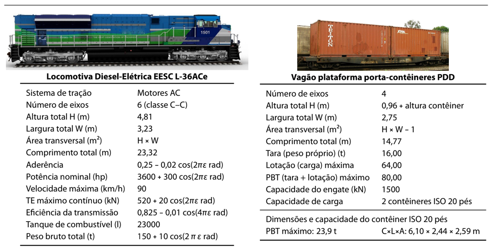

| **UNIVERSIDADE DE SÃO PAULO** | **ESCOLA DE ENGENHARIA DE SÃO CARLOS** | 
|:--------------------------------|---------------------------------:|
| **STT0408** Fundamentos de Engenharia de Transportes  |   **1º semestre de 2025**  |
| **Atividade 2** : Resistência ao movimento  | **Entrega**: Classroom |

# INSTRUÇÕES:

Nesta aula prática, você deverá usar um valor $\varepsilon$ para determinar valores dos parâmetros usados nos problemas. Para encontrar $\varepsilon$, use os **cinco últimos dígitos** do seu número USP. Por exemplo:

- Número USP (NUSP): 87654321 
- Cinco últimos dígitos (X): 54321
- $\varepsilon = X / 1000 = 54,321$

Você deverá montar uma planilha para calcular a força motriz e a resistência ao movimento de uma composição ferroviária formada por $N_L$ locomotivas e $N_V$ vagões, considerando as características das locomotivas e dos vagões. 

Usando essa planilha e os dados fornecidos, considere uma composição formada por uma locomotiva `EESC L-36ACe` e 20 vagões plataforma `PDD` carregados. Para esse trem, plote um gráfico que mostre as relações Força vs. Velocidade para o trem viajando em:

- um trecho plano e reto;
- um aclive de 1%; e
- um declive de 0,5%.

---

# QUESTÕES:

Submeta um arquivo PDF com os gráficos dos cálculos e a resposta das seguintes questões: 

1. Qual a velocidade de cruzeiro do trem em cada uma dessas situações? Admita que a potência usada para mover o trem no declive seja nula e máxima no trecho plano e no aclive.

2. Qual deve ser a aderência mínima para o trem usar toda a potência disponível na partida?

3. Qual a potência necessária para mover o trem a 25 km/h num trecho reto e plano?

