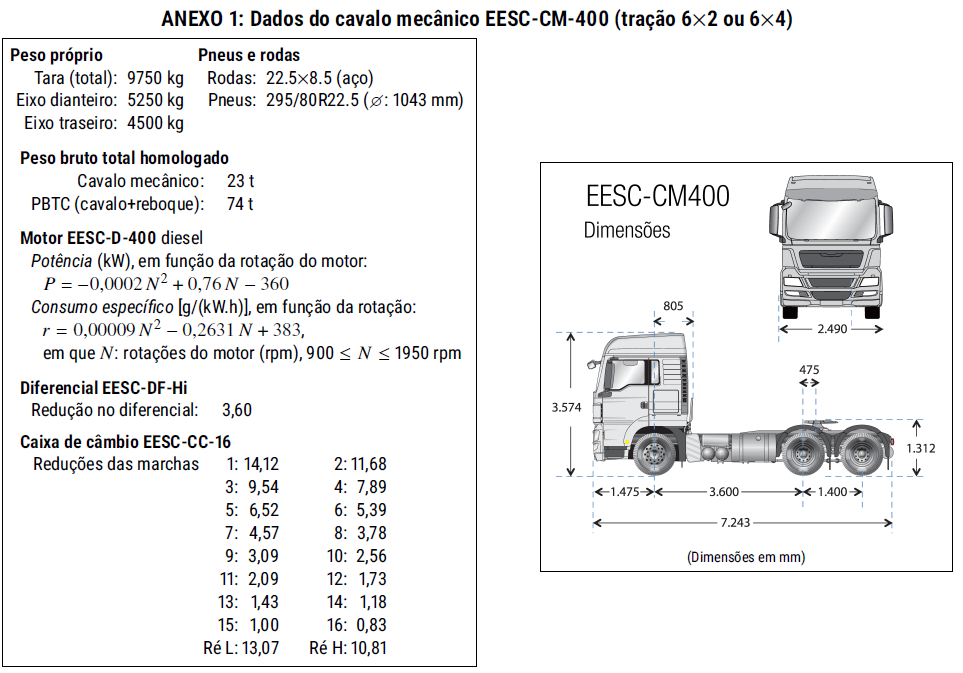
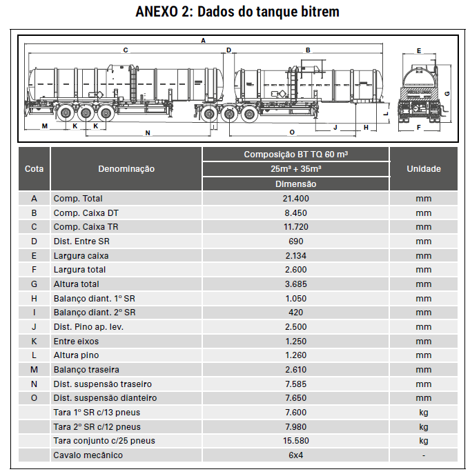

| **UNIVERSIDADE DE SÃO PAULO** | **ESCOLA DE ENGENHARIA DE SÃO CARLOS** | 
|:--------------------------------|---------------------------------:|
| **STT0408** Fundamentos de Engenharia de Transportes  |   **1º semestre de 2025**  |
| **Atividade 5** : Resistências em caminhões  | **Entrega**: Classroom |

# INSTRUÇÕES:

Nesta aula prática, você deverá aplicar os conhecimentos de Força Motriz e Resistências em Veículos Rodoviários. 

**Entregue um relatório em PDF com os gráficos, considerações, justificativa e resultados obtidos.**

A partir dos dados dos ANEXOS 1 e 2, responda as questões:

---

# QUESTÕES:

1. Qual o PBTC (Peso Bruto Total Combinado) da configuração do veículo (ANEXOS 1 e 2) de acordo com os limites legais de pesagem?

2. Plote a curva Força Tratora vs. Velocidade para este veículo.

3. Plote a função Resistências ao movimento vs. Velocidade deste veículo para os aclives: 0,5%, 3,0% e 8,4%.

4. Para a velocidade de equilíbrio nos aclives de 0,5%, 3% e 8,4%, qual a marcha e a rotação do motor (rpm) com o menor consumo de combustível?

5. Qual a frenagem necessária para manter uma velocidade de 50 km/h em declives de -2% e -5%?

