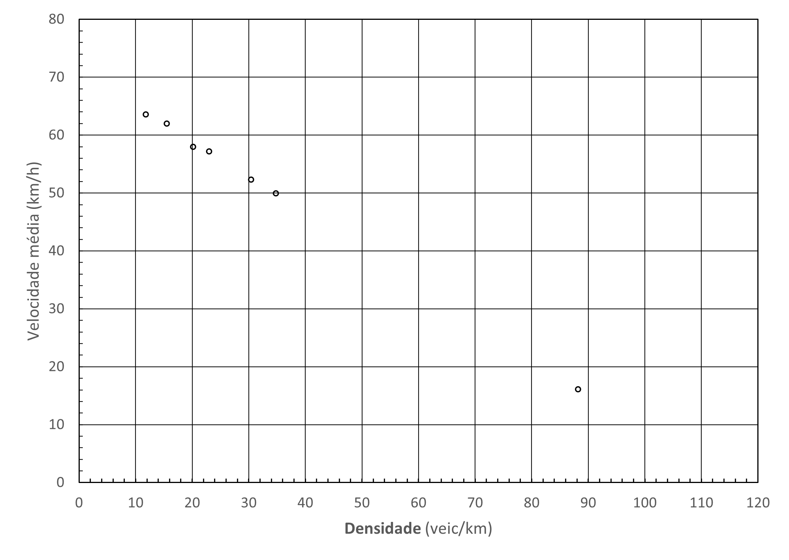

| **UNIVERSIDADE DE SÃO PAULO** | **ESCOLA DE ENGENHARIA DE SÃO CARLOS** | 
|:--------------------------------|---------------------------------:|
| **STT0408** Fundamentos de Engenharia de Transportes  |   **1º semestre de 2025**  |
| **Atividade 8** : Modelos de correntes de tráfego  | **Entrega**: Classroom |

# INSTRUÇÕES:

Nesta aula prática, você deverá aplicar os conhecimentos de Modelagem de correntes de Força Motriz e Resistências em Veículos Rodoviários. 

**Entregue um relatório em PDF com os gráficos, considerações, justificativa e resultados obtidos.**

---

# QUESTÕES:

1. Ao observar o fluxo veicular numa única faixa de rolamento de uma rodovia, você determina que
o espaçamento médio entre veículos sucessivos é $50~m$ e que o headway médio é $3,2~s$. Calcule, para esta corrente de tráfego observada:

  - a taxa de fluxo;
  
  - a velocidade média; e
  
  - a densidade.

2. Em coletas de dados em campo, é comum usarmos diferentes dispositivos. Com um drone é possível observar um trecho da via de $400~m$ e as velocidades observadas são: 88, 90, 105, 112, 97 e 105 km/h. Neste mesmo trecho, foi coletado o tempo de viagem médio ($1,10s$) a partir dos dados de tráfego provenientes de mapas online. Determine as velocidades no tempo e espaço.

3. Bruce Greenshieds, no seu artigo *A Study of Traffic Capacity* (1935), usou os dados a seguir para propor uma relação entre a velocidade média da corrente de tráfego e a densidade:

<!--  -->

| **Densidade (veic/km)**	| 11,8	| 15,5	| 20,2	| 23,0	| 30,5	| 34,8	| 88,3 |
| ----------------------- | ----- | ----- | ----- | ----- | ----- | ----- | ---- | 
| **Velocidade (km/h)**	  | 63,6	| 61,9	| 57,9	| 57,1	| 52,3	| 49,9	| 16,1 |

Calibre a equação linear entre Velocidade e Densidade e obtenha:

  - a velocidade livre ($u_f$) e a densidade de congestionamento ($k_j$) da corrente de tráfego observada por Greenshields

  - a capacidade da corrente de tráfego
  
  - a velocidade da corrente de tráfego quando o volume for $1500~veic/h$?

<!-- 3. Numa autoestrada, a relação entre a velocidade média e a densidade é
$u = 105 \cdot (1 - \frac{k}{90,91}$

em que a velocidade é dada em km/h e a densidade, em veic/km. Calcular:

  a. a velocidade de fluxo livre $u_f$;
  b. a densidade de congestionamento $k_j$;
  c. a taxa de fluxo máxima (capacidade) $q_c$; e
  d. a velocidade na capacidade $u_c$.

3. Observando um trecho de via na capacidade, obteve-se a velocidade na capacidade $u_c$ de $60~km/h$ e a capacidade de $3750~veic/h$. Determine a equação de Velocidade vs. Densidade e os parâmetros fundamentais:

  a. a velocidade de fluxo livre $u_f$;
  b. a densidade de congestionamento $k_j$;
-->

4. Um pesquisador, analisando dados de uma via expressa, propõe a seguinte expressão para a relação entre velocidade $u$ e densidade $k$ da corrente de tráfego:

$$u = 0,001k^2 - 0,564k + 65,88$$

  - Determine a velocidade de fluxo livre $u_f$, a densidade de congestionamento $k_j$, a capacidade da via $q_c$ e a velocidade na capacidade $u_c$. Apresente a relação fluxo-velocidade e a relação fluxo-densidade.

5. Calibre as equações do modelo de Greenshields para os dados fornecidos na planilha anexa no Classroom. Determine os parâmetros fundamentais.
 
